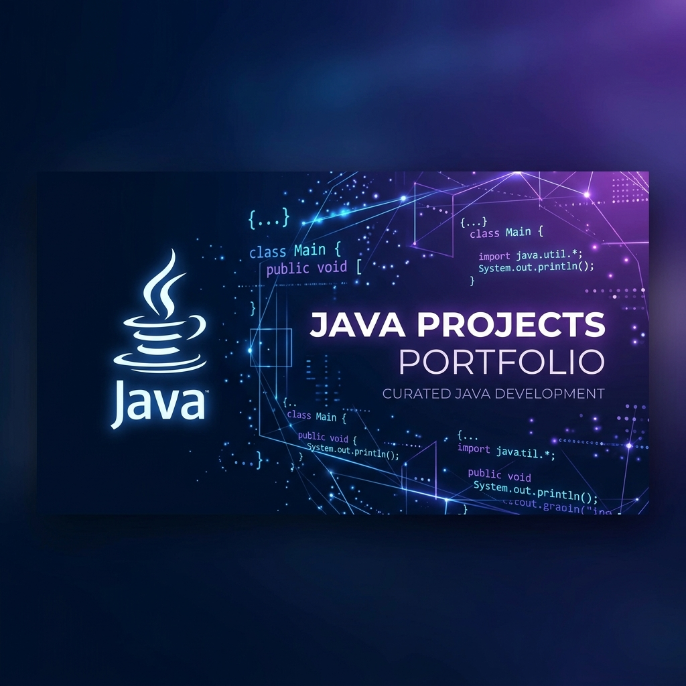
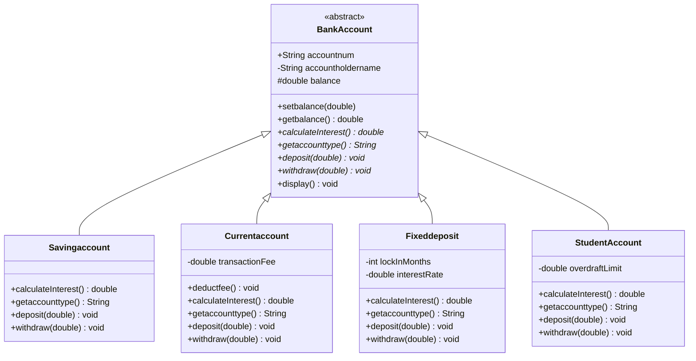
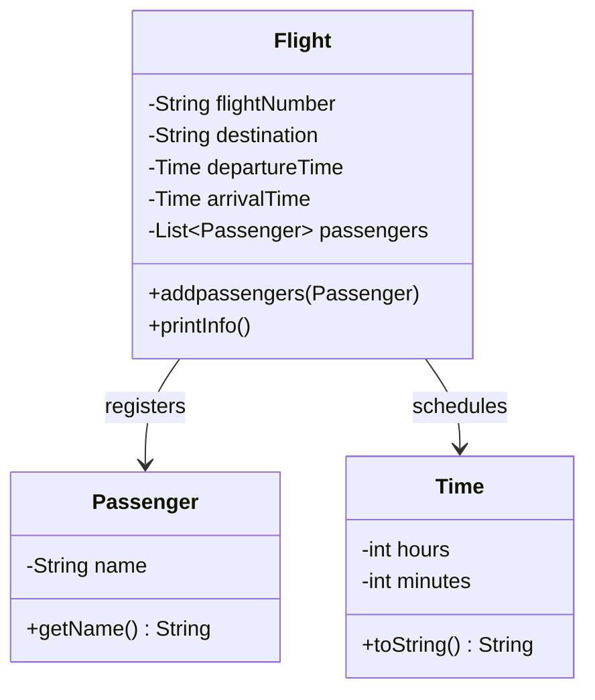
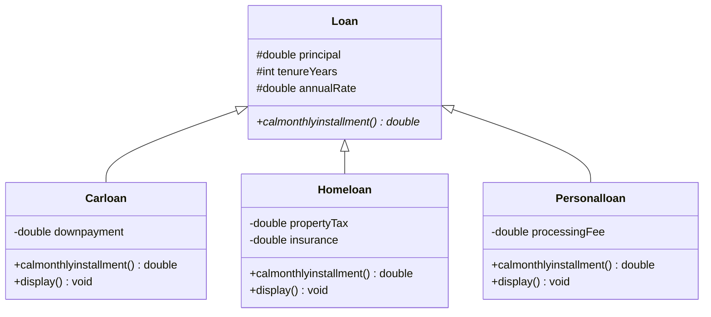
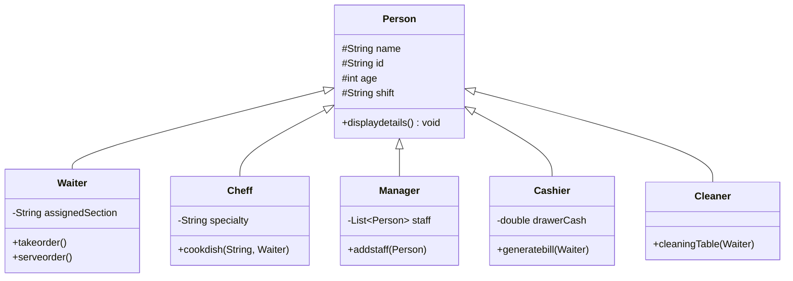
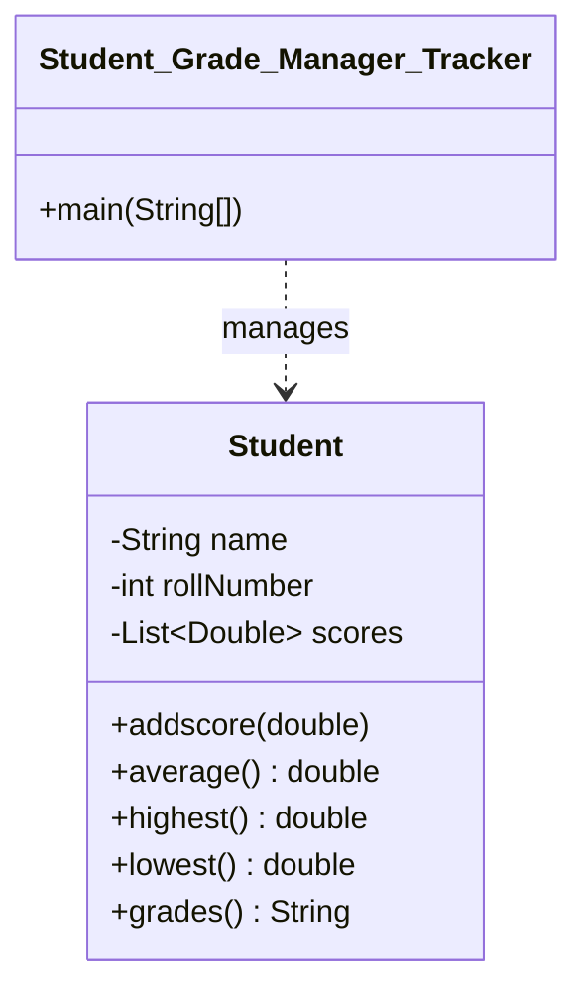
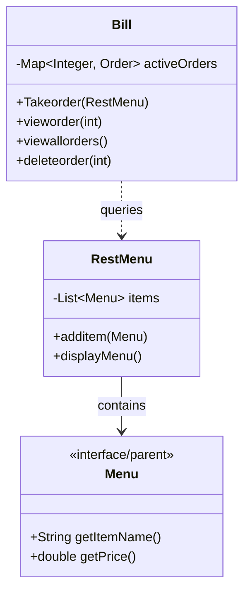

# ☕ Java Projects Hub

[](https://www.oracle.com/java/)
[](https://opensource.org/licenses/MIT)
[](https://makeapullrequest.com)
[](https://github.com/asad594)

Welcome to the **Java Projects Hub**! This repository is a curated collection of object-oriented, interactive, console-driven Java applications. Designed to showcase clean architecture, object-oriented design patterns (Inheritance, Polymorphism, Abstraction, and Encapsulation), and database-like CRUD simulation in memory, these projects represent robust standalone applications.

---

<p align="center">
  
</p>

---

## 🗺️ Navigation Index

Click on any project title below to jump directly to its overview, key details, and execution guide:

1. [🏥 Bank Management System](#1-bank-management-system)
2. [✈️ Flight Management System](#2-flight-management-system)
3. [💵 Loan Management System](#3-loan-management-system)
4. [🍽️ Restaurant Staff Management System](#4-restaurant-staff-management-system)
5. [📈 Student Grade Tracker & Manager](#5-student-grade-tracker--manager)
6. [🍔 Restaurant Order & Billing System](#6-restaurant-order--billing-system)

---

## 🛠️ Tech Stack & Requirements

- **Language:** Java 8 or higher (Recommended: Java 17+)
- **IDE Support:** IntelliJ IDEA, Eclipse, NetBeans, or VS Code
- **Build Tool:** Plain Java Compiler (`javac`)
- **Paradigm:** Object-Oriented Programming (OOP)

---

## 📦 Project Showcases

---

### 1. 🏥 Bank Management System
**Directory:** [`Bank Management system Java`](./Bank%20Management%20system%20Java/)

A comprehensive banking suite simulating real-world accounts. It utilizes inheritance to build dedicated behavior for savings, current, student, and fixed deposit accounts.

#### 🏗️ Architecture Diagram


#### 🔍 Interactive Details
<details>
<summary>⚡ View Key Features & Terminal Preview</summary>

- **Features:**
  - Interest calculation specific to account type.
  - Transaction fee deduction for checking/current accounts.
  - Withdrawal limits & penalty management.
  - Hard lock-in logic for Fixed Deposits.
- **Run Sample:**
  ```text
  Enter the type of account
  1.Savings Account
  2.Current Account
  3.Fixed Deposit Account
  4.Student Account
  > 1
  ----------------SAVINGS ACCOUNT--------
  Account number: A1-1023
  ACCOUNT HOLDER NAME : ASAD
  BALANCE : 12000.0
  ```
</details>

---

### 2. ✈️ Flight Management System
**Directory:** [`Flight Management System`](./Flight%20Management%20System/)

An OOP-focused model simulating passenger booking management, flight schedules, and departure/arrival itineraries.

#### 🏗️ Architecture Diagram


#### 🔍 Interactive Details
<details>
<summary>⚡ View Key Features & Terminal Preview</summary>

- **Features:**
  - Automated passenger manifest generation.
  - Flexible departure & arrival time tracking via Custom Time objects.
  - Dynamic ticket logging.
- **Run Sample:**
  ```text
  =========FLIGHT 1========================
  Flight No: PK-101
  Destination: New York
  Departure: 03:10
  Arrival: 09:10
  Passengers: Asad, Ali, Aman, Abdullah
  ```
</details>

---

### 3. 💵 Loan Management System
**Directory:** [`Loan Management System java`](./Loan%20Management%20System%20java/)

Calculates monthly installments and interest logic for distinct financial products including Car, Home, and Personal Loans.

#### 🏗️ Architecture Diagram


#### 🔍 Interactive Details
<details>
<summary>⚡ View Key Features & Terminal Preview</summary>

- **Features:**
  - EMI calculation logic with distinct interest formulas.
  - Includes specific overheads like Property Tax, Downpayments, and Processing fees.
- **Run Sample:**
  ```text
  ------------CAR LOAN------------
  Principal: $35,000 | Tenure: 5 Years
  Monthly Installment: $680.50
  ```
</details>

---

### 4. 🍽️ Restaurant Staff Management System
**Directory:** [`Restaurant Management System java`](./Restaurant%20Management%20System%20java/)

Simulates standard workflow, staff hierarchies, and shift coordination for a modern restaurant business model (like Kababjees Fried Chicken).

#### 🏗️ Architecture Diagram


#### 🔍 Interactive Details
<details>
<summary>⚡ View Key Features & Terminal Preview</summary>

- **Features:**
  - Role-based responsibility tracking.
  - Multi-staff shift coordination.
  - Interactive staffing overview.
- **Run Sample:**
  ```text
  CHEFF 1
  Name: Abdul Haq | Specialty: Pasta | Shift: Morning
  Action: Cooked Pasta order requested by Waiter ASAD.
  ```
</details>

---

### 5. 📈 Student Grade Tracker & Manager
**Directory:** [`Student Grade Tracker Manager`](./Student%20Grade%20Tracker%20Manager/)

A CLI tracker mapping student scores to letter grades. Calculates class averages, min/max metrics, and constructs comprehensive report cards.

#### 🏗️ Architecture Diagram


#### 🔍 Interactive Details
<details>
<summary>⚡ View Key Features & Terminal Preview</summary>

- **Features:**
  - Dynamic grade assignment based on GPA intervals.
  - Maximum/Minimum value tracking.
  - Console report-card printer.
- **Run Sample:**
  ```text
  ======Student Scores Report=======
  Student Name : Asad
  Student Scores : [85.0, 92.5, 78.0]
  Student Average Score : 85.16
  Student Highest Score : 92.5
  Student Lowest Score : 78.0
  Student Grade On The Basis Of Average Score : A
  ```
</details>

---

### 6. 🍔 Restaurant Order & Billing System
**Directory:** [`restaurant_order_management_system`](./restaurant_order_management_system/)

An interactive terminal order system containing extensive menu matrices (BBQ, Fast Food, Drinks, Desserts), automated order receipt generations, and ID-based record manipulation (CRUD).

#### 🏗️ Architecture Diagram


#### 🔍 Interactive Details
<details>
<summary>⚡ View Key Features & Terminal Preview</summary>

- **Features:**
  - Comprehensive categorized menu display.
  - Interactive ordering scanner interface.
  - Unique ID assignment for active order state lookup.
  - Memory-based order removal/deletion (CRUD).
- **Run Sample:**
  ```text
  ======= MAIN MENU =======
  1. Give Order & Pay Bill
  2. View Order by ID
  3. View All Orders
  4. Delete an Order
  5. Exit
  Choose option: _
  ```
</details>

---

## 🚀 How to Run the Projects

Ensure you have [JDK](https://www.oracle.com/java/technologies/downloads/) installed. Follow these quick steps to execute any program:

1. **Clone the repository:**
   ```bash
   git clone https://github.com/asad594/Javaa-Projects.git
   cd Javaa-Projects
   ```

2. **Navigate to your desired project directory:**
   ```bash
   # Example: Entering the Restaurant Order Management System
   cd restaurant_order_management_system
   ```

3. **Compile the source files:**
   ```bash
   # Compile the main driver file
   javac *.java
   ```

4. **Launch the application:**
   ```bash
   # Run the class containing the main method
   java Restaurant_Order_Management_System
   ```

*Note: For packages or structures with nested directories, compile from the project root using `javac com/mycompany/project/*.java`.*

---

## 🔮 Future Roadmap

We are constantly enhancing the repository! Here's what's planned next:
- [ ] 🎨 **GUI Upgrades:** Implement Java Swing or JavaFX for interactive user interfaces.
- [ ] 🗄️ **Database Persistence:** Connect PostgreSQL or MySQL using JDBC.
- [ ] 🧪 **Unit Testing:** Implement comprehensive JUnit test suites.
- [ ] 📦 **Build Systems:** Standardize dependency management using Maven or Gradle.

---

## 🤝 Contributing

Contributions make the open-source community an amazing place to learn, inspire, and create. Any contributions you make are **greatly appreciated**.

1. Fork the Project
2. Create your Feature Branch (`git checkout -b feature/AmazingFeature`)
3. Commit your Changes (`git commit -m 'Add some AmazingFeature'`)
4. Push to the Branch (`git push origin feature/AmazingFeature`)
5. Open a Pull Request

---

## 📜 License

Distributed under the **MIT License**. See `LICENSE` for more details.

---

<p align="center">Made with ❤️ by <a href="https://github.com/asad594">Asad</a></p>
